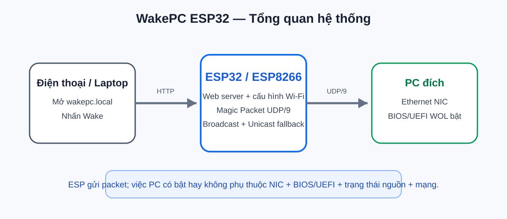
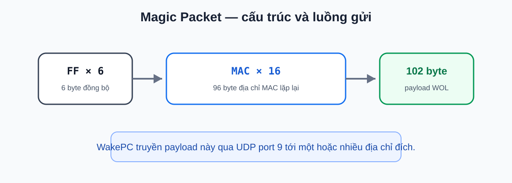
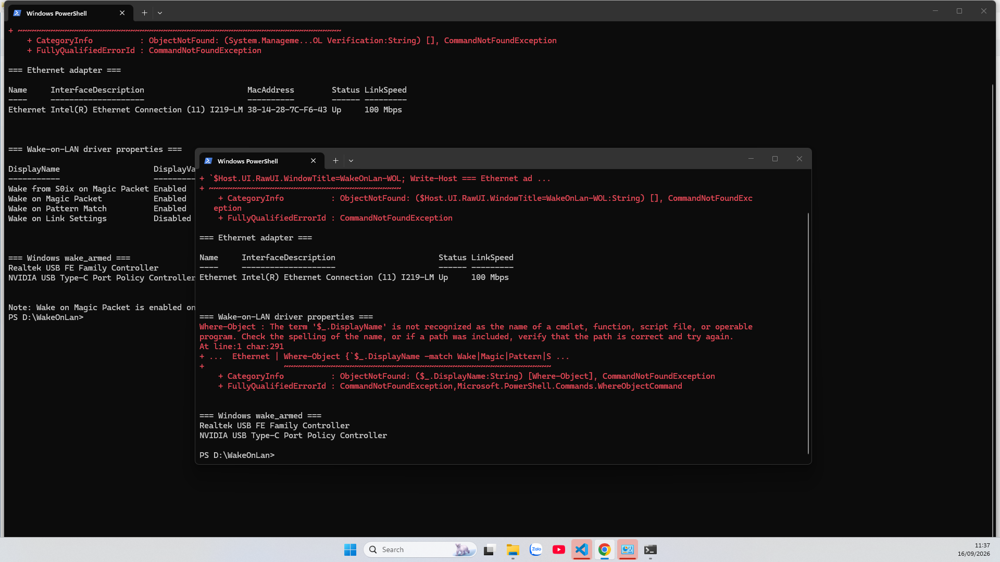
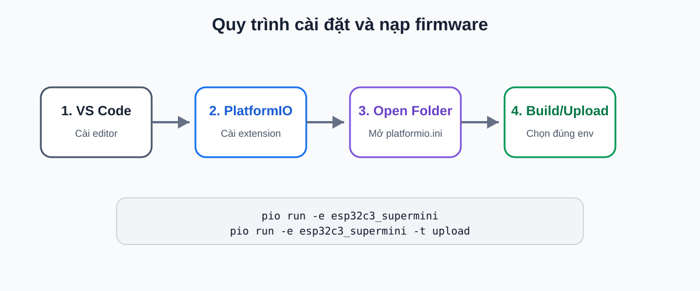
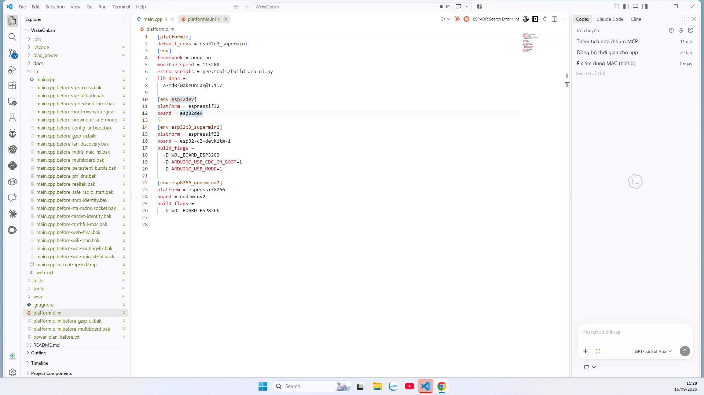
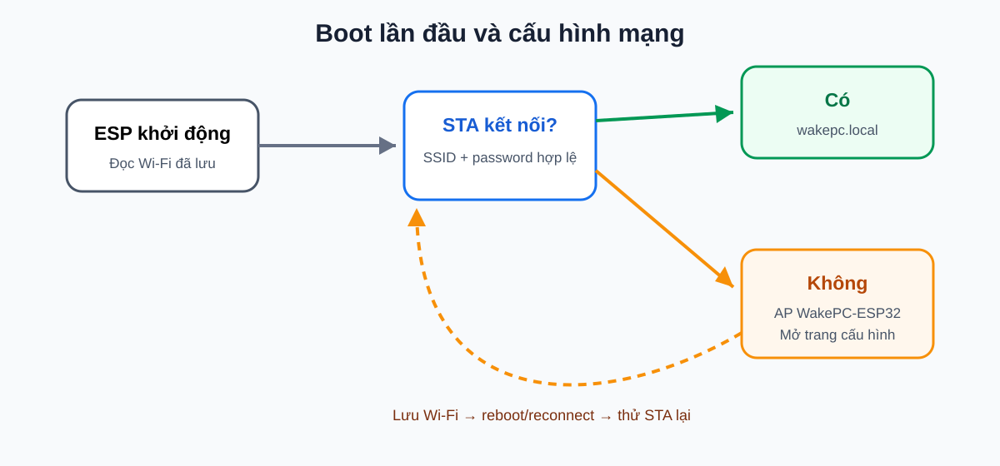
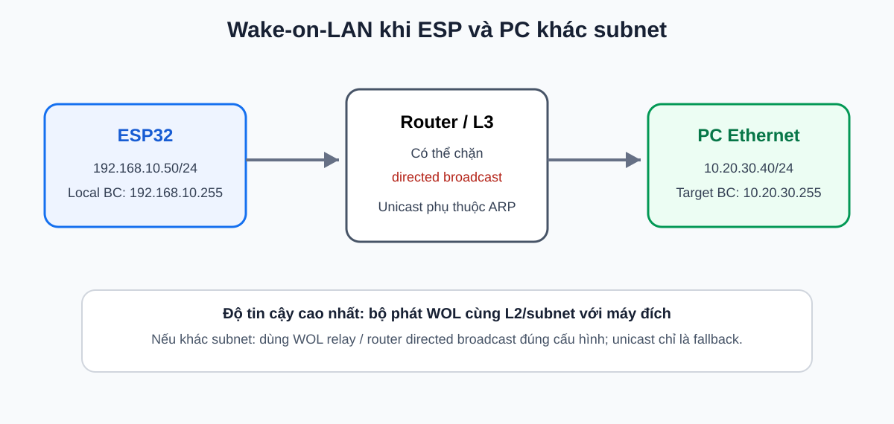

# WakePC ESP32 — Wake-on-LAN Web Controller

> Bộ điều khiển Wake-on-LAN dùng ESP32/ESP8266, cấu hình và kích hoạt máy tính qua giao diện web. Firmware hỗ trợ ESP32-C3 Super Mini, ESP32 DevKit và ESP8266 NodeMCU.

<p align="center">
  
</p>

## Mục lục

- [1. Chức năng chính](#1-chức-năng-chính)
- [2. Phần cứng và phần mềm cần có](#2-phần-cứng-và-phần-mềm-cần-có)
- [3. Nguyên lý Wake-on-LAN](#3-nguyên-lý-wake-on-lan)
- [4. Chuẩn bị máy tính cần đánh thức](#4-chuẩn-bị-máy-tính-cần-đánh-thức)
- [5. Cài Visual Studio Code và PlatformIO](#5-cài-visual-studio-code-và-platformio)
- [6. Tải project và mở bằng PlatformIO](#6-tải-project-và-mở-bằng-platformio)
- [7. Chọn đúng board](#7-chọn-đúng-board)
- [8. Build firmware](#8-build-firmware)
- [9. Nạp firmware](#9-nạp-firmware)
- [10. Khởi động lần đầu và kết nối Wi-Fi](#10-khởi-động-lần-đầu-và-kết-nối-wi-fi)
- [11. Truy cập giao diện WakePC](#11-truy-cập-giao-diện-wakepc)
- [12. Cấu hình máy đích](#12-cấu-hình-máy-đích)
- [13. Gửi Wake-on-LAN](#13-gửi-wake-on-lan)
- [14. Mạng khác subnet / VLAN](#14-mạng-khác-subnet--vlan)
- [15. Kiểm tra khi máy không bật](#15-kiểm-tra-khi-máy-không-bật)
- [16. Lệnh kiểm tra hữu ích trên Windows](#16-lệnh-kiểm-tra-hữu-ích-trên-windows)
- [17. Cấu trúc project](#17-cấu-trúc-project)
- [18. Build cho từng board](#18-build-cho-từng-board)
- [19. Kiểm thử](#19-kiểm-thử)
- [20. Lưu ý bảo mật](#20-lưu-ý-bảo-mật)
- [21. Tài liệu tham khảo](#21-tài-liệu-tham-khảo)

---

## 1. Chức năng chính

WakePC biến một ESP32/ESP8266 thành bộ phát **Magic Packet** hoạt động 24/7 trong mạng nội bộ.

Các chức năng chính:

- Giao diện web để bật máy tính từ điện thoại hoặc máy khác.
- Truy cập bằng `http://wakepc.local/` khi mDNS hoạt động.
- Có AP fallback để cấu hình khi chưa kết nối được Wi-Fi.
- Lưu cấu hình Wi-Fi và máy đích vào bộ nhớ thiết bị.
- Hỗ trợ MAC của máy đích.
- Hỗ trợ broadcast của subnet hiện tại.
- Hỗ trợ broadcast đích cấu hình riêng cho mạng khác subnet.
- Hỗ trợ **unicast fallback** tới IPv4 của máy đích khi router chặn directed broadcast.
- Gửi nhiều Magic Packet theo burst để tăng độ tin cậy.
- Hỗ trợ nhiều board qua PlatformIO.

### Board được hỗ trợ

| PlatformIO environment | Board |
|---|---|
| `esp32c3_supermini` | ESP32-C3 Super Mini |
| `esp32dev` | ESP32 DevKit / ESP32-WROOM |
| `esp8266_nodemcuv2` | ESP8266 NodeMCU v2 |

---

## 2. Phần cứng và phần mềm cần có

### Phần cứng

- 01 ESP32-C3 Super Mini, ESP32 DevKit hoặc ESP8266 NodeMCU.
- Cáp USB có truyền dữ liệu.
- Máy tính có Ethernet và hỗ trợ Wake-on-LAN.
- Router / switch / access point.
- Một điện thoại hoặc máy khác để gửi lệnh Wake khi máy đích đang tắt.

> **Khuyến nghị:** máy cần đánh thức nên dùng **Ethernet có dây**. Wake-on-LAN qua Wi-Fi phụ thuộc mạnh vào phần cứng và driver, không nên mặc định coi là tương đương Ethernet WOL.

### Phần mềm

- Windows 10/11.
- Visual Studio Code.
- PlatformIO IDE extension.
- Git nếu muốn clone project bằng dòng lệnh.

---

## 3. Nguyên lý Wake-on-LAN

Magic Packet tiêu chuẩn gồm:

- 6 byte `FF`.
- Sau đó MAC đích được lặp lại 16 lần.
- Tổng payload WOL điển hình: **102 byte**.
- Firmware này dùng UDP port **9**.

<p align="center">
  
</p>

ESP không "bật nguồn" máy tính trực tiếp. Nó chỉ gửi packet WOL. NIC, BIOS/UEFI và trạng thái nguồn của máy đích phải hỗ trợ và đang được cấu hình đúng thì máy mới thực sự bật.

---

## 4. Chuẩn bị máy tính cần đánh thức

### 4.1 Bật Wake-on-LAN trong BIOS/UEFI

Tên tùy chọn thay đổi theo hãng. Hãy tìm các mục tương tự:

- Wake on LAN
- LAN Wake
- Wake from PCI-E / PCIe
- Power On By PCI-E
- Wake from S4/S5

Nếu có **ErP**, **Deep Sleep** hoặc tùy chọn cắt hoàn toàn nguồn LAN khi shutdown, cần kiểm tra kỹ vì chúng có thể làm NIC mất nguồn và không còn nghe Magic Packet.

### 4.2 Bật tính năng trong Windows Device Manager

1. Nhấn `Win + X` → **Device Manager**.
2. Mở **Network adapters**.
3. Chọn card Ethernet dùng để Wake.
4. Mở tab **Advanced**.
5. Bật các mục có sẵn tương ứng:
   - `Wake on Magic Packet` → `Enabled`
   - `Shutdown Wake Up` → `Enabled` nếu driver có mục này
   - `Wake on Pattern Match` → tùy nhu cầu; Magic Packet là mục quan trọng nhất cho dự án này
6. Nếu có tab **Power Management**, kiểm tra tùy chọn cho phép thiết bị đánh thức máy.

> Không phải mọi máy/driver đều có cùng danh sách thuộc tính.

<p align="center">
  
</p>

> Ảnh trên là kiểm tra thực tế trên Windows. Hãy xác nhận `Wake on Magic Packet` là `Enabled`. Có thể kiểm tra bổ sung bằng `powercfg /devicequery wake_armed`; kết quả mục này phụ thuộc driver và trạng thái nguồn.

### 4.3 Xác định đúng MAC Ethernet

Mở PowerShell hoặc Command Prompt:

```powershell
ipconfig /all
```

Tìm adapter **Ethernet** đang dùng và ghi lại `Physical Address`.

Ví dụ dạng:

```text
02-11-22-33-44-55
```

Khi nhập vào WakePC có thể dùng dạng:

```text
02:11:22:33:44:55
```

### 4.4 Xác định IPv4 và subnet

Ví dụ:

```text
IPv4 Address : 10.20.30.40
Subnet Mask  : 255.255.255.0
Gateway      : 10.20.30.1
```

Với `/24`, broadcast tương ứng là:

```text
10.20.30.255
```

Không sao chép các giá trị ví dụ này nếu mạng của bạn khác.

---

## 5. Cài Visual Studio Code và PlatformIO

### Bước 1 — Cài Visual Studio Code

Tải VS Code từ trang chính thức của Microsoft và cài bình thường.

### Bước 2 — Cài PlatformIO IDE

1. Mở VS Code.
2. Mở **Extensions** (`Ctrl + Shift + X`).
3. Tìm `PlatformIO IDE`.
4. Cài extension chính thức của PlatformIO.
5. Khởi động lại VS Code nếu được yêu cầu.

PlatformIO IDE đã tích hợp PlatformIO Core nên với cách dùng thông thường không cần cài Core riêng.

<p align="center">
  
</p>


<p align="center">
  
</p>
---

## 6. Tải project và mở bằng PlatformIO

### Cách A — Clone bằng Git

```powershell
git clone https://github.com/TranDangKhoaAutomation/WakeOnLan.git
cd WakeOnLan
code .
```

### Cách B — Download ZIP

1. Vào trang GitHub của project.
2. Chọn **Code** → **Download ZIP**.
3. Giải nén.
4. Trong VS Code chọn **File → Open Folder** và mở thư mục chứa `platformio.ini`.

PlatformIO sẽ đọc cấu hình project và tự tải dependency cần thiết khi build lần đầu.


<p align="center">
  
</p>
---

## 7. Chọn đúng board

Project được thiết kế để dùng nhiều environment PlatformIO.

### ESP32-C3 Super Mini

```powershell
pio run -e esp32c3_supermini
```

### ESP32 DevKit / ESP32-WROOM

```powershell
pio run -e esp32dev
```

### ESP8266 NodeMCU

```powershell
pio run -e esp8266_nodemcuv2
```

> Không chọn environment chỉ dựa vào cổng COM. Cổng COM không cho biết loại MCU.

---

## 8. Build firmware

Từ Terminal trong VS Code:

```powershell
pio run -e esp32c3_supermini
```

Build thành công khi PlatformIO kết thúc với trạng thái `SUCCESS`.

Để kiểm tra cả ba target:

```powershell
pio run -e esp32c3_supermini -e esp32dev -e esp8266_nodemcuv2
```


<p align="center">
  
</p>

> Ảnh chụp là một lần build thực tế của environment `esp32c3_supermini`. Khi source thay đổi, số liệu RAM/Flash có thể thay đổi; tiêu chí bắt buộc là PlatformIO kết thúc với `SUCCESS`.
---

## 9. Nạp firmware

### 9.1 Xác định cổng COM

```powershell
pio device list
```

Ví dụ ESP32-C3 có thể xuất hiện như `COM21`, nhưng máy khác có thể là số COM khác.


> **Trước khi upload:** chạy `pio device list` và xác nhận thiết bị ESP32/USB CDC/JTAG-Serial thực sự xuất hiện. Không chọn một cổng COM chỉ dựa vào số cổng hoặc vì nó đang có sẵn trên máy.

### 9.2 Nạp bằng environment

```powershell
pio run -e esp32c3_supermini -t upload
```

Nếu project đã cấu hình cổng upload cố định nhưng máy bạn dùng COM khác, sửa đúng `upload_port` hoặc truyền cổng phù hợp theo cấu hình PlatformIO hiện tại.

### 9.3 Nếu ESP32-C3 không vào chế độ nạp

Với một số board C3:

1. Giữ nút **BOOT**.
2. Nhấn **RESET** nếu board có nút reset.
3. Thả RESET.
4. Thả BOOT.
5. Nạp lại firmware.

Không làm thao tác này nếu board đã upload bình thường.

---

## 10. Khởi động lần đầu và kết nối Wi-Fi

Sau khi boot, thiết bị có thể phát AP fallback:

```text
WakePC-ESP32
```

Luồng thiết lập:

1. Dùng điện thoại/laptop kết nối AP `WakePC-ESP32`.
2. Mở trang cấu hình của thiết bị.
3. Quét Wi-Fi nếu giao diện cung cấp chức năng scan.
4. Chọn SSID cần dùng.
5. Nhập mật khẩu Wi-Fi.
6. Lưu cấu hình.
7. ESP kết nối vào Wi-Fi STA.
8. Sau khi STA hoạt động, truy cập bằng `wakepc.local` hoặc IP mà router cấp cho ESP.

<p align="center">
  
</p>

> Nếu mDNS không hoạt động trên thiết bị đang dùng, hãy mở bằng IPv4 của ESP thay vì cho rằng firmware đã lỗi.

---

## 11. Truy cập giao diện WakePC

Trên thiết bị ở cùng mạng với ESP, thử:

```text
http://wakepc.local/
```

Nếu không được, xem IP ESP trên router hoặc Serial Monitor rồi mở trực tiếp, ví dụ:

```text
http://192.168.10.50/
```

Địa chỉ trên chỉ là ví dụ từ một lần kiểm chứng thực tế; router của bạn có thể cấp IP khác.

---

## 12. Cấu hình máy đích

Các trường quan trọng:

### MAC máy đích

Đây là địa chỉ MAC của **Ethernet NIC cần Wake**.

Ví dụ:

```text
02:11:22:33:44:55
```

### Broadcast WOL đích

Dùng broadcast của subnet chứa máy cần Wake.

Ví dụ máy đích:

```text
IP      10.20.30.40
Mask    255.255.255.0
```

thì broadcast:

```text
10.20.30.255
```

### IP máy đích — unicast fallback

Nếu ESP và máy đích khác subnet, router có thể chặn directed broadcast. Khi đó firmware có thể gửi thêm Magic Packet tới IPv4 máy đích, ví dụ:

```text
10.20.30.40
```

Có thể dùng:

```text
off
```

để tắt unicast fallback nếu không cần.

> Unicast fallback **không phải bảo đảm tuyệt đối** khi máy đã tắt lâu. Router có thể hết ARP entry của máy đích, lúc đó packet unicast không còn được chuyển thành frame tới đúng MAC.

---

## 13. Gửi Wake-on-LAN

1. Đảm bảo ESP đang online.
2. Mở `wakepc.local` hoặc IP của ESP.
3. Kiểm tra MAC đích.
4. Nhấn nút **Wake / Bật máy** trên giao diện.
5. Firmware gửi nhiều Magic Packet UDP/9 theo chuỗi burst tới các đích phù hợp.

Các loại đích firmware có thể sử dụng:

1. Broadcast của subnet Wi-Fi hiện tại.
2. Broadcast đích đã cấu hình.
3. IPv4 máy đích dạng unicast fallback.
4. Limited broadcast `255.255.255.255`.

Firmware tránh gửi trùng khi các địa chỉ đích trùng nhau.

### Dấu hiệu ở Serial Monitor

Khi debug có thể thấy log kiểu:

```text
[WOL] tx destination=192.168.10.255 port=9 packets=3 ok=1
[WOL] tx destination=10.20.30.255 port=9 packets=3 ok=1
[WOL] tx destination=10.20.30.40 port=9 packets=3 ok=1
[WOL] tx destination=255.255.255.255 port=9 packets=3 ok=1
```

`ok=1` chỉ cho biết phía ESP gửi UDP thành công; **không tự chứng minh máy tính đã nhận packet hoặc đã bật**.

---

## 14. Mạng khác subnet / VLAN

Đây là lỗi dễ gặp nhất khi ESP gửi WOL nhưng PC không bật.

Ví dụ topology:

```text
ESP32:      192.168.10.50/24
PC Ethernet: 10.20.30.40/24
```

ESP broadcast `192.168.10.255` chỉ nằm trong subnet `192.168.10.0/24`; nó không tự đi tới `10.20.30.0/24`.

<p align="center">
  
</p>

### Cách xử lý theo thứ tự ưu tiên

**Tốt nhất:** đặt bộ phát WOL cùng Layer-2/subnet với máy cần Wake.

**Nếu phải đi qua router:**

- Có thể cần router hỗ trợ directed broadcast / WOL relay.
- Một số mạng doanh nghiệp chặn directed broadcast vì lý do bảo mật.
- Unicast fallback tới IPv4 máy đích có thể hoạt động khi router vẫn còn ARP mapping.
- Với hệ thống cần độ tin cậy cao, cấu hình router/WOL relay đúng cách tốt hơn phụ thuộc vào ARP cache.

---

## 15. Kiểm tra khi máy không bật

Không sửa firmware ngẫu nhiên. Kiểm tra theo tầng.

### Tầng 1 — ESP có hoạt động không?

- Có nguồn.
- Serial boot bình thường.
- Có AP fallback khi cần.
- STA kết nối Wi-Fi.
- Web truy cập được.

### Tầng 2 — Cấu hình máy đích đúng chưa?

- MAC có đúng **Ethernet NIC** không?
- Không lấy nhầm MAC Wi-Fi, VMware, Bluetooth hay adapter ảo.
- IPv4 và broadcast có đúng subnet không?

### Tầng 3 — ESP có gửi packet không?

Mở Serial Monitor và kiểm tra log `[WOL] tx ...`.

### Tầng 4 — Packet có tới mạng máy đích không?

Có thể dùng Wireshark hoặc một UDP listener trên máy đích khi máy còn đang bật để xác minh packet UDP/9.

Magic Packet đúng phải chứa:

```text
FF FF FF FF FF FF
```

sau đó là MAC đích lặp lại 16 lần.

### Tầng 5 — NIC/BIOS có nhận Wake khi máy tắt không?

Nếu packet đã được chứng minh là đến đúng Ethernet NIC khi máy đang bật nhưng shutdown xong vẫn không Wake:

- Kiểm tra BIOS/UEFI WOL.
- Kiểm tra đèn link Ethernet sau shutdown.
- Kiểm tra `Wake on Magic Packet`.
- Kiểm tra `Shutdown Wake Up` nếu driver có.
- Kiểm tra ErP / Deep Sleep.
- Kiểm tra trạng thái nguồn S3/S4/S5 của máy.

### Quan trọng về S5

Windows không đảm bảo WOL từ mọi trạng thái shutdown S5. Một số máy có firmware/OEM hỗ trợ đánh thức NIC từ S5, một số máy không. Vì vậy việc ESP phát packet đúng không đồng nghĩa mọi máy đều có thể Wake từ full shutdown.

---

## 16. Lệnh kiểm tra hữu ích trên Windows

### Xem MAC / IP

```powershell
ipconfig /all
```

### Xem adapter mạng

```powershell
Get-NetAdapter | Format-Table Name, InterfaceDescription, Status, MacAddress, LinkSpeed
```

### Xem IPv4

```powershell
Get-NetIPAddress -AddressFamily IPv4 | Format-Table InterfaceAlias, IPAddress, PrefixLength
```

### Xem thiết bị đang được Windows arm để Wake

```powershell
powercfg /devicequery wake_armed
```

> Kết quả này hữu ích cho chẩn đoán nhưng không phải bằng chứng duy nhất về khả năng Wake từ S5; firmware BIOS/OEM vẫn có vai trò.

### Xem thiết bị có khả năng Wake theo Windows

```powershell
powercfg /devicequery wake_programmable
```

---

## 17. Cấu trúc project

Cấu trúc chính của project:

```text
WakeOnLan/
├─ platformio.ini
├─ src/
│  ├─ main.cpp
│  └─ web_ui.h              # web đã gzip/generate cho firmware
├─ web/
│  └─ index.html            # nguồn giao diện web
├─ tests/
│  └─ test_*.py             # regression/source tests
├─ tools/
│  └─ ...                   # script hỗ trợ build/generate/test nếu có
├─ docs/
│  └─ images/
└─ README.md
```

`web/index.html` là nguồn giao diện dễ chỉnh sửa; `src/web_ui.h` là asset firmware được generate/gzip theo workflow của project. Không nên sửa hai bản độc lập rồi để chúng lệch nhau.

---

## 18. Build cho từng board

### ESP32-C3 Super Mini

```powershell
pio run -e esp32c3_supermini
```

Upload:

```powershell
pio run -e esp32c3_supermini -t upload
```

### ESP32 DevKit

```powershell
pio run -e esp32dev
```

Upload:

```powershell
pio run -e esp32dev -t upload
```

### ESP8266 NodeMCU v2

```powershell
pio run -e esp8266_nodemcuv2
```

Upload:

```powershell
pio run -e esp8266_nodemcuv2 -t upload
```

---

## 19. Kiểm thử

Trước khi phát hành firmware mới nên chạy:

```powershell
python -m pytest tests
```

hoặc chạy tập test theo workflow thực tế của project nếu repository dùng script riêng.

Sau đó build toàn bộ environment:

```powershell
pio run -e esp32c3_supermini -e esp32dev -e esp8266_nodemcuv2
```

Kiểm thử phần mềm không thay thế kiểm thử WOL thực tế. Với thay đổi liên quan packet/network, nên xác minh tối thiểu:

1. ESP boot được.
2. Wi-Fi/AP hoạt động.
3. Web tải được.
4. Settings lưu và đọc lại được.
5. Packet Magic Packet đúng 102 byte.
6. MAC trong payload đúng.
7. Packet tới đúng interface/subnet mục tiêu.
8. Test Wake thực tế từ thiết bị thứ hai sau khi máy đích sleep/shutdown theo trạng thái cần hỗ trợ.

---

## 20. Lưu ý bảo mật

- Không commit SSID/password Wi-Fi thật vào source public.
- Không commit token hoặc credential cá nhân.
- Không mở trực tiếp giao diện WakePC ra Internet nếu chưa có cơ chế bảo vệ phù hợp.
- WOL qua Internet nên thực hiện qua VPN hoặc giải pháp mạng an toàn thay vì port-forward UDP tùy tiện.
- Directed broadcast có thể bị router chặn chủ động vì các rủi ro liên quan broadcast amplification.

---

## 21. Tài liệu tham khảo

- PlatformIO IDE for VS Code: https://docs.platformio.org/en/stable/integration/ide/vscode.html
- PlatformIO Core installation: https://docs.platformio.org/en/latest/core/installation/
- Microsoft — System power states / Wake-on-LAN: https://learn.microsoft.com/en-us/windows/win32/power/system-power-states
- Microsoft — Wake on LAN behavior: https://learn.microsoft.com/en-us/troubleshoot/windows-client/setup-upgrade-and-drivers/wake-on-lan-feature
- Intel — Enabling Wake-on-LAN: https://www.intel.com/content/www/us/en/support/articles/000059062/ethernet-products/intel-killer-ethernet-products.html
- WakeOnLan Arduino library: https://github.com/a7md0/WakeOnLan

---

## Tác giả

**Trần Đăng Khoa Automation**

Repository: https://github.com/TranDangKhoaAutomation/WakeOnLan
